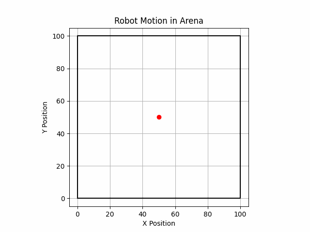

# GSoC-2025 JdeRobot Python Challenge
## Brownian Motion Robot Simulation

This repository contains the solution for the GSoC 25 JdeRobot python challenge. The goal of this project is to simulate Brownian Motion-like behaviour on a robot, where the robot moves randomly within a square arena. 

## Project Structure 
```
gsoc25_py_jderobot/
├── demo
│   ├── demo.py
│   └── robot_motion.gif
├── robot
│   ├── __init__.py
│   ├── animation.py
│   ├── arena.py
│   ├── robot.py
│   └── simulator.py
├── README.md
└── setup.py
```

## Tested on
python 3.10.12

## Usage
- create virtual evironment and activate 
```
python3 -m venv venv
source venv/bin/activate
```
- steup
```
pip install -e .
```
- run demo code
```
python demo/demo.py 
```

## Result

<p align="center">  </p>
